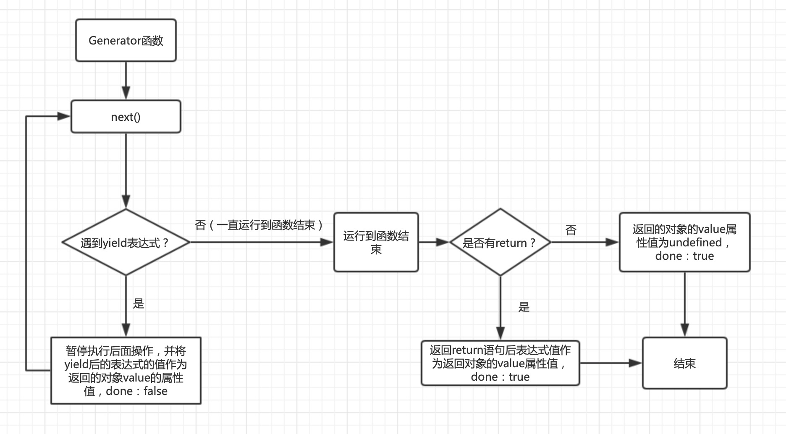

#### Generator
##### 简介
* Generator 函数是 ES6 提供的一种异步编程解决方案
* 语法上，Generator 函数是一个状态机，封装了多个内部状态。执行 Generator 函数会返回一个遍历器对象，也就是说，Generator 函数除了状态机，还是一个遍历器对象生成函数。返回的遍历器对象，可以依次遍历 Generator 函数内部的每一个状态。


* 形式上，Generator 函数是一个普通函数
  * function关键字与函数名之间有一个星号
  * 函数体内部使用yield表达式，定义不同的内部状态

* 调用 Generator 函数后，函数并不执行，返回的也不是函数运行结果，而是一个指向内部状态的指针对象
  >如下函数有三个状态：hello，world 和 return 语句（结束执行）。
  
  ```
  function* helloWorldGenerator() {
    yield 'hello';
    yield 'world';
    return 'ending';
  }
  var hw = helloWorldGenerator();
  console.log(hw.next());// { value: 'hello', done: false }
  console.log(hw.next());// { value: 'world', done: false }
  console.log(hw.next());// { value: 'ending', done: false }
  console.log(hw.next());// { value: 'undefined', done: false }
  ```
  >1.必须调用遍历器对象的next方法，使得指针移向下一个状态；<br/>
  2.Generator 函数是分段执行的，yield表达式是暂停执行的标记，而next方法可以恢复执行。<br/>
  3.返回值中value为当前表达式的值<br/>
  4.done为false表示遍历未结束<br/>
  5.done为true表示遍历结束

* 遍历器对象的next方法的运行逻辑如下

##### yield
* yield表达式就是暂停标志。
* yield表达式只能用在 Generator 函数里面，用在其他地方都会报错。

```
var arr = [1, [[2, 3], 4], [5, 6]];
var add = function *(num){
  num.forEach(function (item) {
      if (typeof item !== 'number') {
        yield* flat(item);
      } else {
        yield item;
      }
  });
}
for (var f of add(arr)){
  console.log(f); //报错
}

//报错原因：forEach方法的参数是一个普通函数，但是在里面使用了yield表达式 ，可以用for循环代替

var arr = [1, [[2, 3], 4], [5, 6]];

var flat = function* (num) {
  var length = num.length;
  for (var i = 0; i < length; i++) {
    var item = num[i];
    if (typeof item !== 'number') {
      yield* flat(item);
    } else {
      yield item;
    }
  }
};

for (var f of flat(arr)) {
  console.log(f);
}
```
* yield表达式如果用在另一个表达式之中，必须放在圆括号里面。
  ```
  function* demo() {
    console.log('Hello' + yield); // SyntaxError
    console.log('Hello' + yield 123); // SyntaxError

    console.log('Hello' + (yield)); // OK
    console.log('Hello' + (yield 123)); // OK
  }
  console.log(demo.next())
  ```
* yield表达式如果用在另一个表达式之中，必须放在圆括号里面。
  ```
  console.log('Hello' + (yield));
  ```
* yield表达式用作函数参数或放在赋值表达式的右边，可以不加括号。
```
function* demo() {
  fn(yield 'one', yield 'two'); // OK
  let value = yield; // OK
}
```
* 如果yield表达式后面跟的是一个遍历器对象，需要在yield表达式后面加上星号，表明它返回的是一个遍历器对象。这被称为yield*表达式。
```
function* foo() {
  yield 'a';
  yield 'b';
}
function* bar() {
  yield 'x';
  yield* foo();
  yield 'y';
}

for (let v of bar()){
  console.log(v);
}
```

