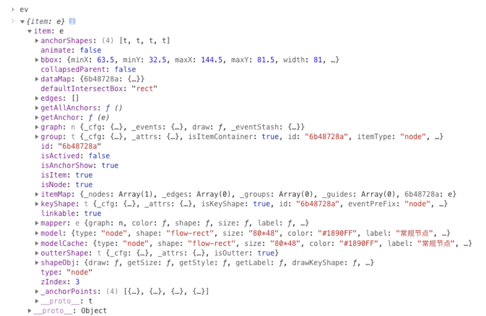

## G6-Editor问题点研究（云方,付裕）
> 主要解决问题点
* 1.node自定义绘制节点（节点的注册）
* 2.edge（边的注册）
* 3.detailpannel属性显示，属性的修改（text，color，size）
* 4.page
* 5.锚点的位置,连接事件，点击事件，可控制是否显示，是否可作为源锚点添加边等
* 6.数据的保存和读取

* 1.<font coloe="#f00" face="黑体"> G6Editor与Extjs的结合</font>
* 2.<font coloe="#f00" face="黑体">自动绘制</font> 
  * 在其他页面中添加节点或修改内容后可根据数据在页面中自动绘制出新的流程图
* 3.<font coloe="#f00" face="黑体">工作流模版</font> 
  * 实例可能会和提供模版有差别，比如报销单，模版中的某个流程点为审核人员，实例中的该点有可能会在审核完成后变为审核人的头像并且后面会有个小对号表示审核已完成
* 4.node节点中自定义属性的动态修改
* 5.node图形的修改（如图形右半部分的icon动态修改成我们需要的图片）
* 6.page中canvas的属性研究
* 7.edge控制节点连接线个数
* 8.缩略图需求(后期需考虑该需求)
* 9.edge上的文字，是否可换为图标icon，其颜色和倾斜角度是否可变化

## 以下为已研究问题点详情
### node（付裕）
##### 1.自定义绘制节点
左边可以放置svg或者缩略图在itempannel中
```<div id="itempannel"></div>```

###### 1）注册节点 先注册一个基础节点
```const Flow = G6Editor.Flow;
// 注册模型卡片基类
Flow.registerNode('model-card', {
  draw(item) {
    const group = item.getGraphicGroup();
    const model = item.getModel();
    const width = 184;
    const height = 40;
    const x = -width / 2;
    const y = -height / 2;
    const borderRadius = 4;
//addshape给图形组添加基础图形
    const keyShape = group.addShape('rect', {
      attrs: { //基础图形属性
        x,
        y,
        width,
        height,
        radius: borderRadius,
        fill: 'white',
        stroke: '#CED4D9'
      }
    });
    // 左侧色条
    group.addShape('path', {
      attrs: {
        path: [
          [ 'M', x, y + borderRadius ],
          [ 'L', x, y + height - borderRadius ],
          [ 'A', borderRadius, borderRadius, 0, 0, 0, x + borderRadius, y + height ],
          [ 'L', x + borderRadius, y ],
          [ 'A', borderRadius, borderRadius, 0, 0, 0, x, y + borderRadius ]
        ],
        fill: this.color_type
      }
    });
    // 类型 logo
    group.addShape('image', {
      attrs: {
        img: this.type_icon_url,
        x: x + 16,
        y: y + 12,
        width: 20,
        height: 16
      }
    });
    // 名称文本
    const label = model.label ? model.label : this.label;
    group.addShape('text', {
      attrs: {
        text: label,
        x: x + 52,
        y: y + 13,
        textAlign: 'start',
        textBaseline: 'top',
        fill: 'rgba(0,0,0,0.65)'
      }
    });
    // 状态 logo
    group.addShape('image', {
      attrs: {
        img: this.state_icon_url,
        x: x + 158,
        y: y + 12,
        width: 16,
        height: 16
      }
    });
    return keyShape;
  },
  // 设置锚点
  anchor: [
    [ 0.5, 0 ], // 上面边的中点
    [ 0.5, 1 ] // 下边边的中点
  ]
});
```
###### 2）在注册一个单独节点继承基础节点
```
Flow.registerNode('PS-SMART', {
  label: 'PS-SMART 分类',
  color_type: '#1890FF',
  type_icon_url: 'https://gw.alipayobjects.com/zos/rmsportal/czNEJAmyDpclFaSucYWB.svg', //左边icon的url
  state_icon_url: 'https://gw.alipayobjects.com/zos/rmsportal/MXXetJAxlqrbisIuZxDO.svg', //右边的icon的url
  // 设置锚点
  anchor: [
    [ 0.5, 0, {
      type: 'input'
    }],
    [ 0.33, 1, {
      type: 'output'
    }],
    [ 0.66, 1, {
      type: 'output'
    }]
  ]
}, 'model-card');
```

#### 2.detailpannel属性显示（云方）
属性的修改与图形的改变（颜色，大小，text文本等）
容器标识约定data-status


`选中对象时动态获取该对象的属性值`

```
page.on('afteritemselected', ev => {
	
}
```

##### input的onchange事件
`修改节点,边,组名称`

```
        function changeInput(name,value){
            const selectedItems = page.getSelected();
            selectedItems.forEach(item => {
                const updateModel = {};
                updateModel['label'] = value;
                page.update(item, updateModel);
            });
        };
 ```
 `修改节点大小`
       
```

function changeInputSize(name,value){
            const selectedItems = page.getSelected();
            if(name == "gant-width"){
                var newSize = value + '*' + selectedItems[0].model.size.split("*")[1];
            }else if(name == "gant-height"){
                var newSize = selectedItems[0].model.size.split("*")[0] + '*' + value;
            }
            selectedItems.forEach(item => {
                const updateModel = {};
                updateModel['size'] = newSize;
                page.update(item, updateModel);
            });
        };
```
### edge

`注册边`（付裕）
```
G6.registerEdge(name, {
  // 绘制
  draw(item) {
	const group = item.getGraphicGroup();
	const path = this.getPath(item);

	const keyShape = group.addShape('path', {
      	attrs: {
        path,//默认路径
        stroke: 'red',
        lineDash: [2, 2], //canvas中的属性，虚线
        endArrow: true  //是否有结束箭头
      }

    return keyShape
  },
  // 获取路径
  getPath(item) {
    return path; // svg 规范 path 路径 
  },
  // 起始箭头
  startArrow: {
    // 路径
    path(item) {},
    // 线缩短偏移
    shorten(item) {},
    // 样式
    style(item) {}
  },
  // 结束箭头
  endArrow: {
    // 路径
    path(item) {},
    // 线缩短偏移
    shorten(item) {},
    // 样式
    style(item) {}
  }
}, extendShape);
```

`线的形状三种`（云方）
```
//flow-polyline折线
//flow-smooth曲线
page.changeAddEdgeModel({
    shape: 'flow-polyline-round'//圆角折线
});
```
### page（付裕）
```
const page = new G6Editor.Flow({
  graph: {
    container: 'page',
    height
  },
  align: {
    grid: true
  },
  noEndEdge: false, //连接线true时可不连接锚点，终端可以悬空，默认是true
  edgeResizeable: true，//为true时选中线段可拖动整个graph，默认true
});
```
`网格（云方）`
```
page.showGrid();
page.hideGrid();
```
### 锚点（云方）
`锚点相对于node的位置，多个的话可用数组形式呈现`
```
anchor: [
  [1, 0.5],
  [0.5,1],
  [0,0.5],
  [0.5,0]
  //[x,y]  x控制水平方向位置0->1，左->右；y控制垂直方向位置0->1，上->下
],
```
`type可控制锚点的输入输出`
```
anchor: [
    [ 0.5, 0, {
        type: 'input'
    }],
    [ 0.5, 1, {
        type: 'output'
    }]
]
```
`锚点的连接事件`

>给节点设置name属性，通过判断链接目标的name属性控制是否可以链接（name可以换成其他属性），该情况下可用作源节点
```
page.on('dragedge:beforeshowanchor', ev=>{
            console.log(ev) //每个节点都会触发这个事件
            if(ev.target.model.name=="yesnode"){
                ev.cancel = true;
            }
            // ev.sourceAnchor  源锚点
            // ev.source        源子项
            // ev.targetAnchor  目标锚点
            // ev.target        目标子项

            // ev.cancel = true; // 若设置为 true 则取消显示要去连接的锚点
        });
```
`鼠标悬浮节点后显示锚点前，可用作控制，锚点是否显示`
```
flow.on('hovernode:beforeshowanchor', ev=>{
  // ev.item    子项
  ev.cancel = true; // 若设置为 true 则取消显示锚点
});  
```
`鼠标悬浮锚点后，开启添加边模式前，可用作控制，哪些锚点可添加边`
```
flow.on('hoveranchor:beforeaddedge', ev=>{
  // ev.anchor  锚点
  // ev.item    子项
  ev.cancel = true; // 若设置该锚点不会触发连接模式
});
```
`锚点点击事件`
```
graph.on('anchor:click', ev=>{});
```

 
### 数据的储存和读取(付裕)
```
const data = flow.save();
```

```
const data = flow.read(data);
```
### 修改节点背景色颜色选择器colpick插件（云方）
```
$('.color-box').colpick({
    colorScheme:'dark',
    layout:'rgbhex',
    color:color,
    onSubmit:function(hsb,hex,rgb,el) {
        const selectedItems = page.getSelected();
        selectedItems.forEach(item => {
            const updateModel = {};
            updateModel['color'] = '#'+hex;
            page.update(item, updateModel);
        });
        $(el).css('background-color', '#'+hex);
        $(el).colpickHide();
    }
})
```


